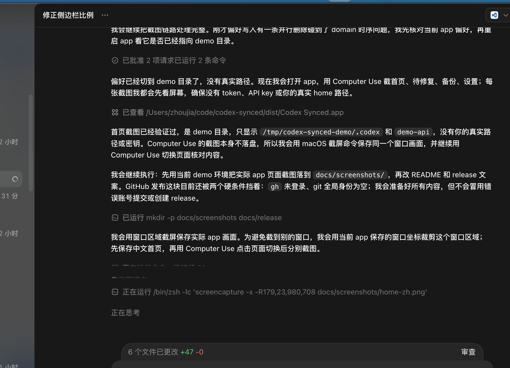
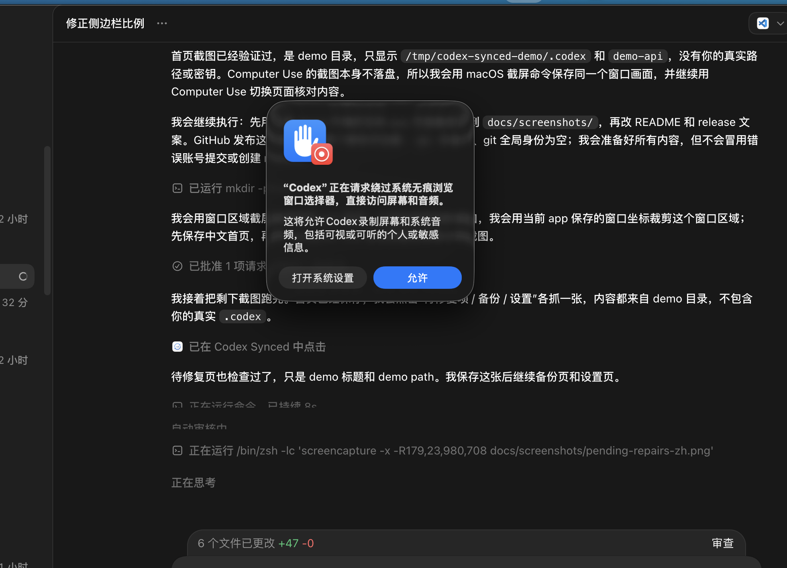
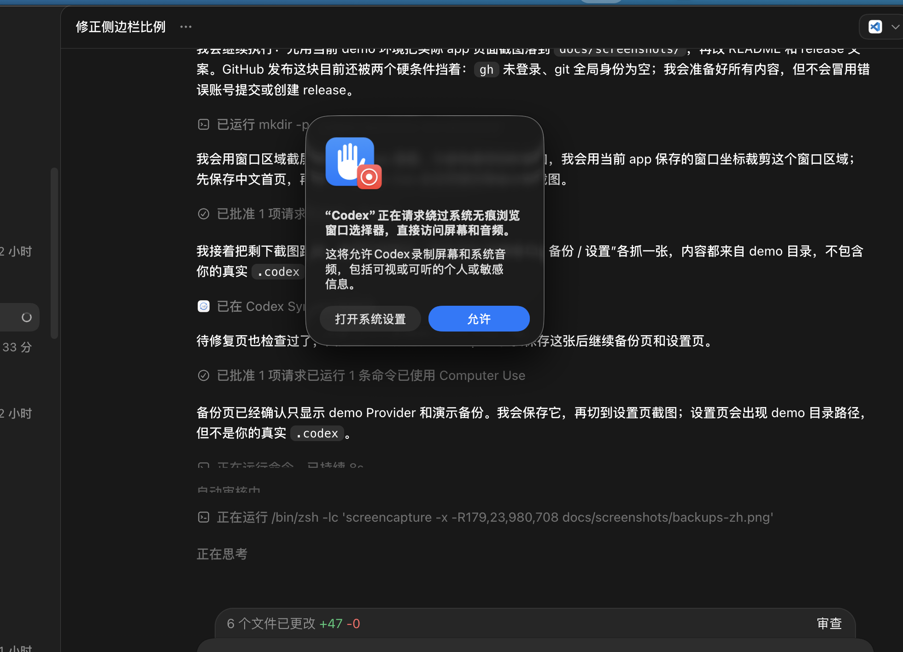
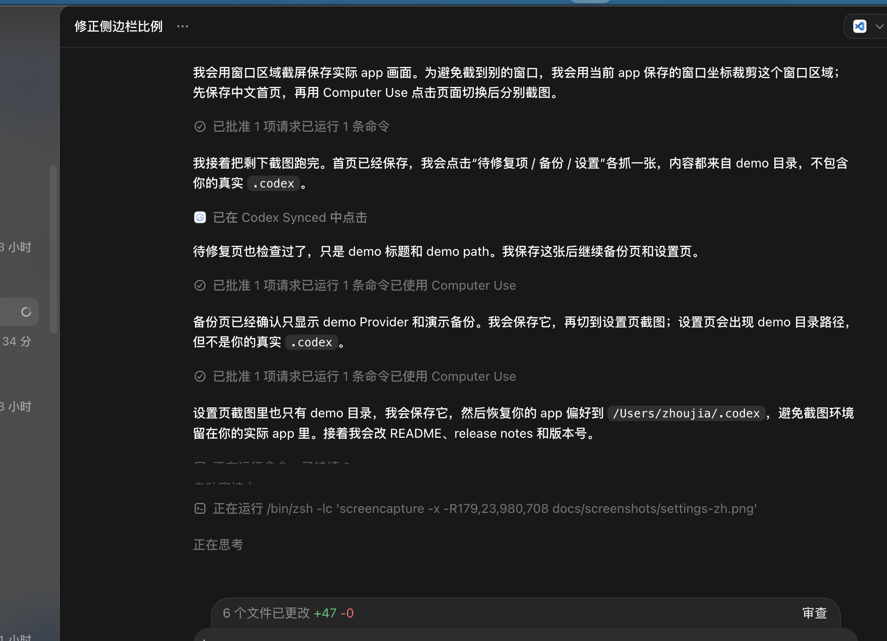

# Codex Synced

中文 | [English](#english)

Codex Synced 是一个 macOS 本地修复工具，用来解决切换 Codex Provider 后“历史会话突然不可见”的问题。

当你在 Codex 官方 OAuth、OpenAI API Key、第三方 API 或自定义 Provider 之间切换时，本地历史里记录的 Provider 可能和当前登录态不一致。Codex Synced 会读取当前 Codex Provider，预览需要修复的本地记录，并在备份后把历史会话重新对齐到当前环境。

它不是云同步工具，也不会上传你的会话。所有扫描、备份、修复都发生在本机。

## 下载与安装

1. 前往 [GitHub Releases](https://github.com/saymyzj/codex-session-synced/releases) 下载 `Codex-Synced-1.0.0.dmg`。
2. 双击打开 DMG。
3. 将 `Codex Synced.app` 拖入 `Applications`。
4. 第一次打开时，如果 macOS 提示来自未验证开发者，请在 Finder 中右键点击应用，选择“打开”，再确认打开。
5. 使用前请先退出 Codex，避免本地状态文件正在被写入。

## 适合谁

- 你切换过 Codex 的官方 OAuth、OpenAI API Key 或第三方 API Provider。
- 你确认历史会话文件仍在本地，但 Codex 界面里看不到。
- 你希望先看清楚会改哪些记录，再决定是否修复。
- 你希望修复前自动备份，并且可以从备份恢复。

## 主要功能

- 自动识别当前 Codex Provider。
- 自动发现本地 `state_*.sqlite`，不写死具体数据库文件名。
- 预览 SQLite Provider 记录、rollout metadata 和 `session_index.jsonl` 缺失项。
- 修复前创建轻简备份或全量备份。
- 轻简备份保存必要回滚数据，全量备份额外保存 sessions。
- 支持从历史备份恢复。
- 中文优先，同时提供 English 界面。

## 使用流程

1. 打开 Codex Synced。
2. 查看首页识别到的 Provider、状态库和待修复数量。
3. 进入“待修复项”，确认变更预览。
4. 选择“轻简备份”或“全量备份”。
5. 点击“备份并修复”。
6. 修复完成后重新打开 Codex，历史会话会按当前 Provider 重新显示。

## 备份与恢复

每次真正写入前，Codex Synced 都会先创建备份。你可以在“备份”页查看已有备份，并在需要时恢复。

默认保留：

- 轻简备份：5 份
- 全量备份：3 份

这些数量可以在设置中调整。

## 安全边界

Codex Synced 的目标很窄：只修复会话历史的本地可见性。

它不会：

- 修改 OAuth Token
- 修改 API Key
- 修改第三方 API URL
- 修改 Provider 配置
- 修改会话正文
- 上传任何本地历史或配置

它会：

- 读取当前 Codex 配置中的根级 `model_provider`
- 读取本地状态数据库和会话索引
- 在你确认后更新必要的 Provider 可见性字段
- 在写入前创建可恢复备份

## 常见问题

### 为什么需要先退出 Codex？

Codex 运行时可能正在读写本地状态文件。为了避免写入冲突，修复和恢复前需要先退出 Codex。

### 应该选轻简备份还是全量备份？

日常修复建议使用轻简备份，它保存恢复所需的关键文件，速度更快、占用更少。若你希望额外保存 sessions 目录，可以选择全量备份。

### 它会同步到云端吗？

不会。Codex Synced 只在本机工作，不提供云同步，也不会上传会话内容。

### 没有待修复项怎么办？

说明当前本地历史已经和当前 Provider 对齐。之后如果切换 Provider，可以重新扫描。

## English

Codex Synced is a local macOS repair tool for Codex conversation history. It helps when conversations still exist on disk but disappear from the Codex UI after switching between the official OAuth flow, OpenAI API key mode, a third-party API, or another custom provider.

Codex Synced reads the active Codex provider, previews the local history records that need alignment, creates a backup, and then repairs local visibility data. It is not a cloud sync tool. Everything happens on your Mac.

## Download and Install

1. Download `Codex-Synced-1.0.0.dmg` from [GitHub Releases](https://github.com/saymyzj/codex-session-synced/releases).
2. Open the DMG.
3. Drag `Codex Synced.app` into `Applications`.
4. On first launch, if macOS blocks the app, right-click it in Finder, choose “Open”, and confirm.
5. Quit Codex before repairing or restoring local history.

## Highlights

- Detects the active Codex provider automatically.
- Finds the latest local `state_*.sqlite` database.
- Previews SQLite provider rows, rollout metadata, and missing `session_index.jsonl` entries.
- Creates a lightweight or full backup before writing.
- Restores from previous backups when needed.
- Provides both Chinese and English UI.

## Safety

Codex Synced does not modify OAuth tokens, API keys, third-party URLs, provider settings, or message bodies. It only repairs local history visibility data after you review the preview and choose a backup mode.

## Basic Workflow

1. Open Codex Synced.
2. Review the detected provider and pending repair count.
3. Open “Pending Repairs” and inspect the preview.
4. Choose “Lightweight” or “Full” backup.
5. Click “Back Up and Repair”.
6. Reopen Codex and check your history.
